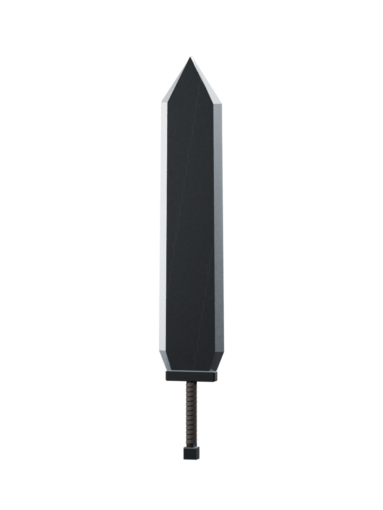

# Dragonslayer for Bannerlord

An original Berserk-inspired sword mod for **Bannerlord v1.4.8.119303**, Windows Steam build **24573425**. Single-player only; multiplayer and co-op are untested and unsupported.

**Deployable test build:** the default package includes the original custom sword meshes and textures, imported and Client-published with the matching Bannerlord editor. Client and editor DLLs compile against the installed game. All in-game testing is pending user feedback; this is not a gameplay-verified release. See [how to test](#how-to-test) and the [verification record](docs/VERIFICATION.md). Unofficial fan project, not affiliated with TaleWorlds or the owners of Berserk.



## Features

- [Guts Powers — Phase 1](docs/GUTS_POWERS.md): separate optional, configurable active-wielder strength/handling, shield pressure and poise. Disable the Instant Kill add-on when testing this mortal-swordsman mode. Later phases are not yet implemented.
- Optional [Instant Kill add-on](docs/INSTANT_KILL.md), packaged separately. The original working sword is preserved at source tag `dragonslayer-standalone-v0.1.1` and in its standalone ZIP; enabling the add-on is optional.
- New item `dragonslayer`, four mod-owned crafting pieces and a private template. No native item/asset replacement.
- Normal native two-handed sword animations, blocking, swings and thrusts. No one-handed usage.
- Long blade: 98.9 cm at 145% scale, about 143.4 cm before grip/assembly offsets. Native crafting determines final reach, weight and inertia; `dragonslayer.status` reports actual values.
- 180 base cutting damage, 65 piercing thrust damage, slow 58/55 swing/thrust speed ratings, 45 handling and substantial mass.
- Small C# module applies only this item's stats after campaign initialization and provides explicit grant/status commands. No powers, global patches, auto-grants, campaign behaviours or additional save data.

## Prerequisites and build

To play: the exact game version above, with Native, SandBox Core and Sandbox enabled. StoryMode is optional. No DLC or third-party mod dependency. Test first with only official modules and Dragonslayer.

To build: **PowerShell 7+**, .NET SDK **8 or 9**, local game client DLLs and the game's bundled `mono/lib/mono/4.7.2-api` reference assemblies. The original published assets are included, so rebuilding requires no editor import. Blender **4.3.2** and matching Modding Kit **v1.4.8** are needed only to change and republish the art. Neither build tools nor the Modding Kit are needed to install the ZIP.

Run from the repository root:

```powershell
./scripts/validate.ps1     # Portable source validation only
./scripts/test.ps1         # Negative cases and installer safety
./scripts/build.ps1        # Detect game, native XSD checks, compile, package
./scripts/validate-package.ps1 # Extract and check the final custom ZIP
./scripts/install.ps1      # Install the latest build
```

Game detection reads Steam library folders. Override with `-GamePath 'X:/Games/Mount & Blade II Bannerlord'`, environment variable `BANNERLORD_GAME_PATH`, or ignored `local.settings.json` containing `{"gamePath":"X:/Games/Mount & Blade II Bannerlord"}`. Builds and installation check installed module versions against `target-game.json`. Future game updates need an API/schema review and retarget.

Builds go to `artifacts/build-<id>/Modules/Dragonslayer`; the default ZIP is **`artifacts/Dragonslayer-0.1.1-Custom-v1.4.8.zip`**. It includes mod DLLs, XML, original published assets/runtime data, installation hash manifest, documentation and source preview. Matching editor references trigger a second compilation and include `bin/Win64_Shipping_wEditor/Dragonslayer.dll`; the normal client uses its own `Win64_Shipping_Client` DLL. Game assemblies have `Private=false` and are never copied into source control or ZIPs. The source `Modules/Dragonslayer` folder is not itself compiled. `-Visual Prototype` explicitly builds the temporary native visual for troubleshooting.

CI is **Source validation (no game compilation)**: XML relationships, configuration ranges, installer safety, asset script syntax, published asset checksums and isolated instant-kill selection tests. Only the pure hit policy is compiled in CI; it has no game references and does not compile either mod DLL, validate against native XSDs, or run Bannerlord. A green workflow is not a full mod build.

## Installation and removal

Close the game/editor, then run `./scripts/install.ps1`. Alternatively extract the ZIP and copy its `Modules/Dragonslayer` folder into the game's `Modules` directory. The resulting path must be `Modules/Dragonslayer/SubModule.xml`, with no extra nested Dragonslayer folder. Restart the normal game launcher and enable **Dragonslayer (Custom Visual; Test Build)** after Sandbox, preserving the normal official module order. Do not overlay an existing installation: back up and remove only the previous Dragonslayer folder first.

The installer refuses an existing Dragonslayer folder. For a managed update:

```powershell
./scripts/uninstall.ps1
./scripts/build.ps1
./scripts/install.ps1
```

Uninstall checks hashes before removing listed files. It refuses edited files and preserves unlisted files, unrelated modules and all saves. Back up configuration edits and restore the originals before scripted removal. Manual uninstall means removing only `Modules/Dragonslayer`. Use a separate test save: removing an item mod while its items remain in a save can cause missing-item behaviour. Scripts never read or change saves.

## How to test

**0.1.1 crash fix:** fixes new-campaign smithing-order generation failing with `Sequence contains no matching element`. The private template's four pieces must be visible to native smithing/order selection; they can now appear in that system. The fixed grant item still uses its configured stats; other smithing-generated items use native crafting stats. After updating, first retry creating a new test campaign. The earlier 0.1.0 build should no longer be used.

All gameplay checks below are **pending**. Use the normal game client, not the Modding Kit. Start with official modules plus Dragonslayer and a new or separate single-player test save; keep your main campaign untouched.

1. **Startup:** enable Dragonslayer in the launcher. Reach the main menu and start/load your test campaign. Record any dependency, XML or DLL error verbatim.
2. Open the built-in console with **Alt + `** (the key above Tab on a US keyboard).
3. **Obtain:** on the campaign map, run `dragonslayer.give` with no arguments. Each call should add **one** sword. Run `dragonslayer.status` and save its output for your feedback.
4. **Inventory:** close the console, press **I**, and find **Dragonslayer**. Check the thumbnail for the broad dark slab, contrasting edges and wrapped grip. Expected base stats: **180 cutting, 65 piercing, swing/thrust speeds 58/55, handling 45**. Record the reported weight and reach; these are calculated by native crafting and await runtime confirmation.
5. **Equip:** put it in a weapon slot and enter a battle or village scene. Check drawing/sheathing, both hands on the grip and the blade's orientation. Test with a shield carried: the sword should retain its two-handed usage.
6. **Combat:** try left/right/overhead swings, thrusts and blocks. Check the slower handling, visible hit reactions and normal two-handed animations. Compare reach and damage against a native two-hander using similar targets/armour; damage is affected by skills, armour and movement, so 180 is not guaranteed health loss.
7. **Appearance/clipping:** inspect both blade faces, hands, guard and pommel; check the back when sheathed, armour/cloaks, mounted use, close camera views and distant LODs. Check whether hits match the visible blade and whether dropping/picking up preserves the item.
8. **Save/load:** save the test campaign with the sword equipped, exit the game, restart and reload. Verify the sword and stats persist without an extra automatic grant.

The mod-owned grant command is implemented without an additional console mod or a cheat-mode check. Runtime command discovery and granting still need your verification. Merchant stock is disabled; use the command rather than searching shops.

**Send feedback:** list pass/fail for the steps above, your exact game version and enabled modules, the `dragonslayer.status` output, and short reproduction steps for each failure. Include a screenshot for visual problems and the relevant timestamped lines from `%LOCALAPPDATA%/Dragonslayer/Logs/Dragonslayer.log`. For startup/crashes, also include the error text and relevant excerpt from the newest `%PROGRAMDATA%/Mount and Blade II Bannerlord/logs/rgl_log_*`. You do not need to send saves or unrelated personal logs. I will inspect the failure, fix what can be reproduced and supply a rebuilt package.

## Configuration

Edit source `Modules/Dragonslayer/ModuleData/weapon_stats.xml` and rebuild, or edit the installed file and fully restart/load the campaign. Installed XML edits need no DLL rebuild. These are mod-owned configuration fields, not TaleWorlds item XML attributes.

| Field | Default | Units | Accepted range |
|---|---:|---|---|
| `swingDamage` | 180 | Base cutting points, before armour/skill/speed modifiers | integer 1–500 |
| `thrustDamage` | 65 | Base piercing points, before modifiers | integer 1–500 |
| `swingSpeed` | 58 | Engine rating, not attacks/sec or milliseconds | integer 1–200 |
| `thrustSpeed` | 55 | Engine speed rating | integer 1–200 |
| `handling` | 45 | Engine handling rating; higher is easier | integer 1–200 |

These are this mod's enforced ranges, not theoretical engine limits. Invalid/missing configuration logs an error, shows a warning and retains generated crafting stats; no partial settings are applied.

Geometry settings:

- `dragonslayer_items.xml`, `Piece/@scale_factor`: percent, supported **50–200**. Scales the visual and derived weapon geometry together. Extreme values may clip.
- `dragonslayer_pieces.xml`, `CraftingPiece/@weight`: unscaled kilograms, validator accepts **(0,10]** per piece. Defaults: blade 4.0, guard 0.35, grip 0.35, pommel 0.25. Native crafting applies its scaling calculations to produce inventory mass.
- `CraftingPiece/@length`: unscaled mesh length in centimetres, **98.9 / 4.78 / 25 / 5.44**. Geometry metadata, not a free reach slider; keep it matched to exported meshes. The installed XSD has numeric types without useful gameplay bounds here.
- `BladeData/Swing` and `Thrust/@damage_factor`: dimensionless crafting inputs, not damage points. The DLL overrides the resulting damage/speed/handling only for `dragonslayer`.

Keep the IDs, native damage types and two-handed usage stable. Prototype and custom builds share item IDs.

## Diagnostics and troubleshooting

Custom log: `%LOCALAPPDATA%/Dragonslayer/Logs/Dragonslayer.log` (UTC; rotates at 1 MiB to `.previous`). Records module loading, resolved stats, grants and exceptions. Native logs: `%PROGRAMDATA%/Mount and Blade II Bannerlord/logs/`, including `rgl_log_*`, `launcher_log_*` and error logs when present. Build output is printed to the terminal.

- **Mod absent:** avoid double-nesting the extracted folder; restart launcher.
- **Dependency error:** verify exact game version and official IDs. Sandbox's ID is `Sandbox`, despite the `SandBox` folder name. Disable incompatible third-party mods for smoke testing.
- **Unknown command:** verify enabled module and `bin/Win64_Shipping_Client/Dragonslayer.dll`; check for the module-load log entry. If Windows blocked a downloaded DLL, use its file Properties → Unblock where available.
- **Missing item:** inspect native XML errors; the grant command will not conceal failed XML registration by fabricating an item.
- **Native appearance:** expected for the prototype. Source FBX files are not game TPACs.
- **Invisible/pink custom visual:** verify resource names, material texture slots and published client AssetPackages. The mere presence of a TPAC does not verify its contents.
- **Unexpected damage/speed:** inspect `dragonslayer.status` and the log for configuration failures. Base damage does not guarantee a fixed health loss through every armour/skill combination.
- **Failure after updating:** finish Steam verification and recheck versions/APIs; do not substitute random DLLs.

Report the action, exact version, prototype/custom variant, enabled modules and relevant log excerpt. See the [in-game checklist](docs/VERIFICATION.md).

## Original asset source

```powershell
& 'C:/path/to/blender.exe' --background --factory-startup --python assets/generate_sword.py
& 'C:/path/to/blender.exe' --background --factory-startup --python assets/verify_exports.py
```

Creates four centred crafting-part FBXs with LODs/UVs, packed `.blend`, 512×512 PBR textures and a source-only preview. The `pbr_metallic` specular texture packs R=metallic, G=glossiness, B=AO, A=0. The flat normal map is intentional: bevels and wrapping are geometry. No external artwork or extracted game assets are included.

The default build uses the checked-in original client assets in `assets/published`, with checksums in `assets/publish-record.json`. Imported editor metadata is preserved in `assets/bannerlord/Assets`. To change the art, follow [editor import and publishing](docs/ASSET_IMPORT.md), then build with your new client output:

```powershell
./scripts/build.ps1 -Visual Custom -PublishedModule 'X:/EditorPublish/Dragonslayer'
```

Custom mode changes only the four mesh references and labels in the build. It requires AssetPackages but cannot certify resource linkage or in-game visuals automatically. No Workshop upload, GitHub release or merge is included in this work. See [implementation evidence](docs/IMPLEMENTATION.md).
